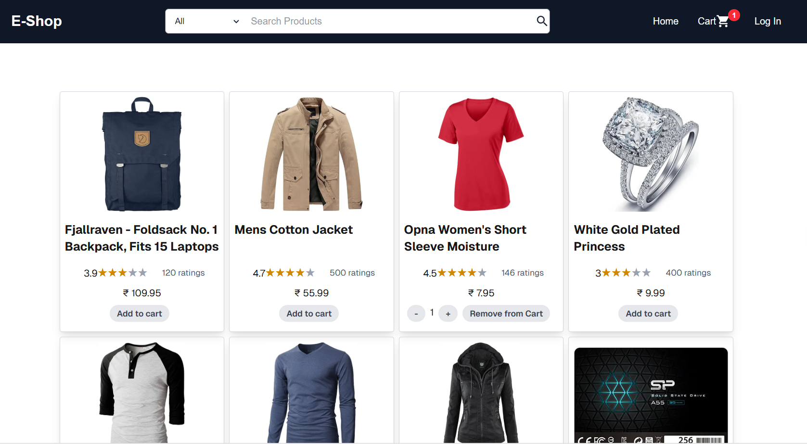

# 🛒 E-Commerce Store (Portfolio Project)

A responsive and fully functional e-commerce web application built with **Next.js**, designed as a portfolio project to showcase my front-end and full-stack development skills.

## 🌟 Features

- 🧾 **Product Listing & Details**

  - Browse products
  - View detailed product descriptions, prices, and images

- 🛒 **Shopping Cart**

  - Add and remove items from the cart
  - Save cart
  - View cart summary and total cost

- 🔍 **Search Functionality**

  - Real-time search to filter products by name

- 📱 **Responsive Design**

  - Mobile-friendly and optimized for all screen sizes

- ⚡ **Fast Performance**
  - Built using Next.js for fast page loads and SEO benefits

## 🧰 Tech Stack

- **Framework:** [Next.js](https://nextjs.org/)
- **Styling:** Tailwind CSS
- **State Management:** React Context / Zustand
- **Deployment:** Vercel

## 📸 Screenshots

